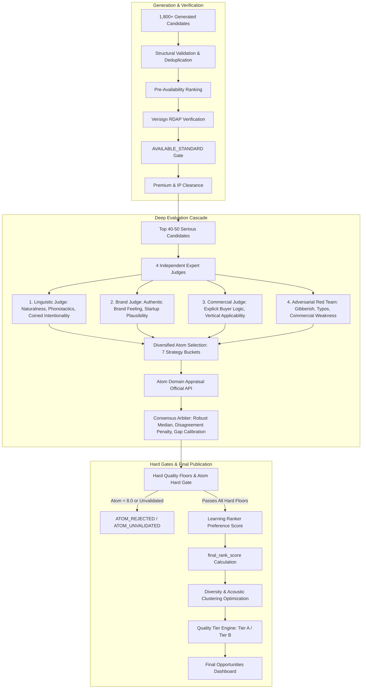

# ◈ DOMAIN HUNTER

> **AI Domain Intelligence Command Center, Multi-Engine Generation & Autonomous Self-Learning Ranker**  
> Desktop-first command center for discovering, generating, scoring, and authoritatively verifying high-value `.com` domains with built-in Linguistic Quality, Buyer Intelligence, IP Risk Screening, and Self-Learning Ranker.

[](https://www.python.org/)
[](https://fastapi.tiangolo.com)
[](https://supabase.com)
[](https://rdap.verisign.com)
[](run_tests.py)
[](#-architecture-overview)

---

## 📖 Overview

**Domain Hunter** is an autonomous AI-driven domain intelligence platform. It tracks real-time global news and search trends across 14 market categories, extracts high-potential commercial concepts using multi-model AI routing, synthesizes brandable `.com` candidates through 7 distinct naming engines, and subjects every candidate to strict authoritative registry verification, linguistic quality scoring, trademark clearance, buyer intelligence analysis, and self-learning ranker optimization.

### 🛡️ The Hard Availability & Clearance Invariant
Unlike typical domain generators that guess availability or rely on cached third-party lists, Domain Hunter enforces an uncompromising contract:
- **Authoritative Registry Truth**: Verifies domain registration directly against **Verisign RDAP** (the official authoritative registry for `.com`) combined with **Cloudflare DNS over HTTPS** (DoH). Test or mock registries are unconditionally blocked from production.
- **Strict Premium Gate**: Cross-checks marketplace endpoints to eliminate hidden registrar markups and inflated premium renewals. Only genuine standard-registration domains qualify.
- **IP & Trademark Risk Clearance**: Screens candidates against the official **USPTO Trademark API** and curated brand intelligence databases using string distance (Levenshtein, Jaro-Winkler) and phonetic algorithms (Soundex, Metaphone). Domains with `CRITICAL` IP risk are rejected automatically.
- **Quality > Quantity Contract**: Only domains verified as `AVAILABLE_STANDARD` with cleared IP risk can enter the opportunity pool. If only 7 candidates pass all gates, 7 are returned—thresholds are never lowered to hit an artificial quota.

---

## ⚡ Key Capabilities

- **Desktop-First Command Center**: Modern dark-mode visual interface with glassmorphism, responsive navigation, and CLI visual identity (`#080A12`).
- **Multi-Engine Generation (Phase 3)**: Generates 1,500–3,000 raw candidates per hunt across 7 specialized naming strategies plus a multilingual engine covering Latin, Italian, Spanish, Nordic, Japanese, and Greek linguistic roots.
- **Buyer Intelligence Engine (Phase 3)**: Evaluates 10 commercial dimensions for each candidate, calculating specific applicability scores for SaaS, Enterprise, E-commerce, FinTech, and Developer Tools.
- **Quality Tiers (Phase 3)**: Organizes validated opportunities into **Tier A** (top-tier brandables, score ≥ 82), **Tier B** (strong niche opportunities, score 70–81), and **Watchlist**. Registered domains are strictly excluded from Tier A/B.
- **Self-Learning Ranker (Phase 4)**: Learns buyer preferences from user interactions (`SHORTLIST`, `FAVORITE`, `REJECT`) using a scikit-learn statistical model trained on an 18-dimensional normalized feature vector.
- **Cold-Start State Machine (Phase 4)**: Transitions gracefully across `COLD_START` (< 100 samples, pure heuristic scoring), `BASELINE` (100–499 samples, 15% preference weight blend), and `ACTIVE` (≥ 500 samples, 30% preference weight blend).
- **Dynamic Quota Allocation (Phase 4)**: Dynamically rebalances generation strategy budgets based on empirical yield and acceptance rates, maintaining a mandatory 5% exploration floor to prevent strategy starvation.
- **Pattern Saturation & Acoustic Clustering**: Penalizes repetitive affixes and clusters phonetic cousins to ensure candidate diversity across runs.
- **Live Terminal & Diagnostics**: Real-time streaming console capturing Python logging events, circuit breakers, and status transitions.
- **Dedicated Availability Scanner**: High-throughput batch checker connecting directly to the authoritative `AvailabilityEngine`.
- **Export Studio**: Direct exports to **CSV**, **Excel (.xlsx)**, **JSON**, and clean **TXT** lists.

---

## 🏗️ System Architecture

```mermaid
graph TD
    subgraph 1. Research & Concept Discovery
        Trends[Google Trends RSS & Category News] --> ConceptAI[ConceptDiscoveryEngine]
        ConceptAI -->|14 Market Categories| Concepts[Opportunity Concepts]
    end

    subgraph 2. Multi-Engine Candidate Generation
        Concepts --> MultiGen[MultiEngineOrchestrator]
        MultiGen --> S1[ONE_WORD Engine]
        MultiGen --> S2[INVENTED Engine]
        MultiGen --> S3[SEMANTIC Engine]
        MultiGen --> S4[COMPOUND Engine]
        MultiGen --> S5[PREFIX_SUFFIX Engine]
        MultiGen --> S6[TREND Engine]
        MultiGen --> S7[KEYWORD Engine]
        MultiGen --> S8[Multilingual Engine]
        S1 & S2 & S3 & S4 & S5 & S6 & S7 & S8 --> RawPool[1,500 - 3,000 Raw Candidates]
    end

    subgraph 3. Filtering & Authoritative Verification
        RawPool --> PreFilter[Cheap Structural & Syntax Filter]
        PreFilter --> DoH[Cloudflare DoH Nameserver Check]
        DoH --> RDAP[Verisign RDAP Official Registry]
        RDAP -->|HTTP 404 Standard| PremCheck[Marketplace Premium Filter]
        PremCheck --> Trademark[USPTO & Brand Risk Engine]
        Trademark -->|Cleared| AvailPool[Verified Available Pool]
    end

    subgraph 4. Scoring, Intelligence & Diversity
        AvailPool --> QualityScore[QualityScorer: 18 Signals]
        QualityScore --> FinalJudge[FinalJudge: Commercial Criteria]
        FinalJudge --> BuyerIntel[BuyerIntelligenceEngine]
        BuyerIntel --> Diversity[DiversityEngine: Saturation & Phonetics]
        Diversity --> RankerBlend[StatisticalRanker Preference Blend]
        RankerBlend --> TierEngine[QualityTierEngine]
    end

    subgraph 5. Output, Persistence & Learning
        TierEngine --> TierA[Tier A Opportunities]
        TierEngine --> TierB[Tier B Opportunities]
        TierEngine --> Watchlist[Watchlist]
        TierA & TierB --> Supabase[(Supabase final_domains)]
        TierA & TierB & Watchlist --> LocalStore[(SQLite learning.db)]
        LocalStore --> Feedback[User Feedback: Shortlist/Reject/Favorite]
        Feedback --> RankerRetrain[Ranker Retraining Pipeline]
        RankerRetrain --> DynamicQuota[StrategyOptimizer Dynamic Quotas]
        DynamicQuota -.->|Next Run Quotas| MultiGen
    end
```

---

## 🔬 Generation Engines & Strategies

| Strategy | Engine Class | Linguistic Method | Description |
|---|---|---|---|
| `ONE_WORD` | [`OneWordEngine`](quality_engine/multi_engine.py) | Authentic English dictionary lookup verified via `wordfreq` | Real dictionary words with high lexical familiarity and Zipf scores. |
| `INVENTED_BRAND` | [`InventedBrandEngine`](quality_engine/multi_engine.py) | CVCVC, CVCCVC, and VCCVCV phonotactic patterns | High-brandability coined neologisms with balanced vowel-consonant ratios. |
| `SEMANTIC_BRAND` | [`SemanticBrandEngine`](quality_engine/multi_engine.py) | Metaphorical root exploration | Meaning-evoking commercial roots across emerging tech niches. |
| `COMPOUND` | [`CompoundEngine`](quality_engine/multi_engine.py) | Two authentic dictionary words combined naturally | Natural word combinations verified against word-glue penalties. |
| `PREFIX_SUFFIX` | [`PrefixSuffixEngine`](quality_engine/multi_engine.py) | High-value tech/domain affixes | Industry affixes (`sync-`, `flow-`, `core-`, `-labs`, `-stack`, `-node`). |
| `TREND` | [`TrendEngine`](quality_engine/multi_engine.py) | Real-time news & search trends | Contextual names synthesized directly from trending topics and news. |
| `KEYWORD_BRANDABLE` | [`KeywordBrandableEngine`](quality_engine/multi_engine.py) | High-CPC commercial verticals | High-intent keywords across B2B, FinTech, Legal, and Infrastructure. |
| `REAL_FOREIGN_WORD` | [`MultilingualEngine`](opportunity_engine/multilingual_engine.py) | Curated multi-language lexicon | Classical Latin, Romance, Greek, Nordic, and Japanese commercial roots. |

---

## 🧠 Quality, Risk & Buyer Intelligence

### 1. Quality Engine (`quality_engine/`)
- **7 Linguistic Morphology Types**: `REAL_WORD`, `FOREIGN_WORD`, `COMPOUND`, `INVENTED`, `PREFIX_SUFFIX`, `HYBRID`, `SEMANTIC_BRANDABLE`.
- **Word Glue Detector**: Distinguishes authentic compounds (`cloudnest`, `ironclad`) from awkward artificial mashups (`techcloudai`), applying targeted penalties.
- **AI-Generated Feel Detector**: Identifies repetitive algorithmic patterns and formulaic constructions.
- **Pattern Saturation Detector**: Monitors affix repetition across the candidate pool; repeated prefixes/suffixes receive progressive quality penalties.
- **Phonetic Acoustic Clustering**: Uses Soundex and Metaphone composite keys to eliminate phonetic cousins and prevent sonic monotony.

### 2. Trademark & IP Risk Engine (`risk_engine/`)
- **Multi-Algorithm String Similarity**: Levenshtein Distance and Jaro-Winkler analysis against curated databases of famous brands.
- **Phonetic Infringement Screening**: Detects phonetic typosquatting and deceptive homophones.
- **Official USPTO Lookup**: Queries the official USPTO Trademark API.
- **Risk Decision Contract**:
  - `LOW` (0–25): Cleared to pass.
  - `MEDIUM` (26–55): Flagged with evidence for user review.
  - `HIGH` (56–80): Heavy quality penalty applied.
  - `CRITICAL` (81–100): Hard rejection—immediately eliminated from the pipeline.

### 3. Buyer Intelligence Engine (`quality_engine/buyer_intelligence.py`)
Evaluates 10 commercial dimensions for each candidate:
- **Primary & Secondary Archetype**: e.g. Enterprise B2B SaaS, Early-Stage AI Startup, Consumer FinTech.
- **Vertical Fit**: Mapping to high-CPC industry niches (Finance, Legal, DevTools, Healthcare).
- **Applicability Matrix**: Normalized 0–100 scores for:
  - `saas_applicability`
  - `startup_applicability`
  - `enterprise_applicability`
  - `ecommerce_applicability`
  - `fintech_applicability`
  - `developer_tool_applicability`
- **Commercial Naturalness**: Assesses how naturally the domain functions as a funded venture name vs. generic web spam.

---

## 📈 Self-Learning Ranker & Feedback Loop (Phase 4)

Domain Hunter includes a continuous learning loop that adapts candidate ranking based on human feedback:

### User Feedback Schema (`learning.db`)
```sql
CREATE TABLE IF NOT EXISTS feedback (
    id INTEGER PRIMARY KEY AUTOINCREMENT,
    candidate_id TEXT NOT NULL,
    domain TEXT,
    user_action TEXT NOT NULL,       -- VIEWED, SHORTLISTED, REJECTED, FAVORITED, PURCHASED, IGNORED
    rejection_reason TEXT,          -- TOO_LONG, HARD_TO_PRONOUNCE, GENERIC, LOW_COMMERCIAL_VALUE, TRADEMARK_CONCERN, OTHER
    notes TEXT,
    created_at TIMESTAMP DEFAULT CURRENT_TIMESTAMP
);
```

### Statistical Ranker (`learning_engine/ranker.py`)
- **Model**: Scikit-Learn `LogisticRegression(C=1.0, max_iter=200)` with Ridge regularization fallback.
- **Feature Vector**: 18 normalized signals capturing structural ergonomics, brandability, pronunciation, memorability, buyer clarity, startup fit, radio score, and category opportunity.
- **Learning State Machine**:
  - **`COLD_START`** (< 100 feedback samples): Pure heuristic quality scoring (`learned_score` weight = 0.0).
  - **`BASELINE`** (100–499 feedback samples): Lightweight preference weight blending (`learned_score` weight = 0.15).
  - **`ACTIVE`** (≥ 500 feedback samples): Full learned model ranking (`learned_score` weight = 0.30).
- **Hard Safety Gate**: Learned preference scores can **never** override availability, premium status, or critical IP risk gates.
- **Dynamic Quota Rebalancing**: Automatically shifts generation quotas toward strategies with high yield and acceptance rates, preserving a **5% minimum exploration floor** across all strategies.
- **Model Router Performance Tracking**: Monitors provider latency, token costs, and failure rates; degrading models are quarantined and failed calls never create training records.

---

## 🏛️ Multi-Model + Adversarial + Atom Appraisal Consensus Architecture (Phase 5)

Domain Hunter eliminates score inflation on weak invented names through a multi-model consensus system coupled with authoritative external market intelligence from **Atom Domain Appraisal**:



### 1. Four Independent Expert Judges
Each expert evaluates candidates with specialized system prompts and distinct model families:
1. **Linguistic Judge**: Native English naturalness, pronunciation, spelling predictability, hear-to-spell, syllable rhythm, semantic anchors, coined-word intentionality vs. random pronounceable strings.
2. **Brand Judge**: Authentic brand feeling, memorability, verbal/visual identity, startup plausibility, distinctiveness, category flexibility.
3. **Commercial Judge**: Explicit buyer logic ("Who realistically buys this?"), buyer breadth, enterprise fit, product flexibility, resale viability.
4. **Adversarial Red-Team Judge**: Dedicated to challenging and attempting to reject candidates. Uncovers gibberish risks, awkward sound clusters, typosquatting traps, hidden vulgarity, synthetic AI feel, and weak buyer logic.

### 2. Consensus Arbiter & Robust Statistics
- **Model Independence**: Judges evaluate independently without seeing peer scores.
- **Robust Median Aggregation**: Eliminates distortion from single model outliers (`scores = [92, 90, 89, 45]` yields a robust median of `89.5` rather than a degraded average).
- **Disagreement Penalty**: Significant variance between expert judges automatically triggers disagreement flags and reduces confidence.
- **Standalone Detectors**:
  - `SHORT_BUT_MEANINGLESS`: Flags short domains that have decent phonetics but lack semantic roots and commercial anchors.
  - `PRONOUNCEABLE_NOT_BRANDABLE`: Catches phonetically fluent but commercially empty coinages.

### 3. Atom Domain Appraisal Integration
- **Official API Endpoint**: `GET https://www.atom.com/api/marketplace/domain-appraisal?domain=<DOMAIN>`
- **Mandatory Quality Gate (`ATOM_REQUIRED_FOR_FINAL=true`)**: Candidates **cannot** appear in Tier A, Tier B, or Final Opportunities without an authoritative Atom appraisal. Unvalidated candidates remain blocked (`ATOM_UNVALIDATED`).
- **Configurable Operating Thresholds**:
  - `ATOM_MIN_DOMAIN_SCORE=8.0` (Candidates below 8.0/10 are marked `ATOM_REJECTED` and blocked from final publication).
  - `ATOM_TIER_A_MIN_DOMAIN_SCORE=8.5` (Tier A requires an independent Atom score ≥ 8.5/10).
- **Diversified Pre-Selection Pool**: Candidate appraisal budget (default 10–25) is proportionally allocated across 7 distinct strategies (`REAL_WORD`, `COMPOUND`, `SEMANTIC`, `STRONG_INVENTED`, `MODERATE_INVENTED`, `PREFIX_SUFFIX`, `OTHER`) to prevent invented names from monopolizing API calls.
- **24-Hour Disk Cache**: Persisted in `data/atom_appraisal_cache.json` with TTL validation to eliminate redundant requests.
- **Normalized Valuation Signal**: Logarithmic monotonic mapping `normalize_atom_appraisal(value)` prevents large dollar amounts from overwhelming ranking.
- **Internal / External Calibration**: Tracks `internal_atom_gap` and generates diagnostic calibration flags (`INTERNAL_OVERVALUATION_RISK`, `ATOM_ALIGNMENT_STRONG`, `ATOM_ALIGNMENT_WEAK`).

### 4. Invented Name Policy & Quality Ceilings
Invented names are strictly classified into 5 evidence tiers:
- **`STRONG_ANCHORED`**: Recognizable roots, high brandability; eligible for Tier A with Atom ≥ 8.5.
- **`MODERATE_ANCHORED`**: Eligible for Tier B.
- **`WEAK_ANCHORED`**: Gated to Watchlist / Review.
- **`UNANCHORED`**: Strict quality ceilings applied; cannot exceed configurable brand confidence and cannot enter Tier A.
- **`EXTREMELY_WEAK`**: Unconditionally excluded from Tier A and Tier B.

### 5. Fail-Closed Final Publication Contract
Domain Hunter enforces **fail-closed** publication:
- Atom unavailable / timeout / unvalidated → **No final publication**.
- IP risk unverified or critical → **No final publication**.
- RDAP unverified → **No final publication**.
- Red-Team critical objection → **No final publication**.
- Quality floor failure → **No final publication**.
Thresholds are **never lowered** to meet an artificial quota.

---

## 🔄 The 11-Stage Pipeline

| Stage | Name | Key Operations |
|:---:|:---|:---|
| 1 | `research` | Ingests real-time Google Trends & category news across 14 market categories. |
| 2 | `concept_extraction` | Extracts multi-category opportunity concepts using LLM routing. |
| 3 | `candidate_generation` | MultiEngineOrchestrator generates 1,500–3,000 raw candidates across 7 strategies + multilingual engine. |
| 4 | `candidate_validation` | Validates RFC 1035 syntax, strips whitespace/punycode, checks label lengths, runs local structural filter. |
| 5 | `availability_check` | Queries Cloudflare DoH & Verisign RDAP (`HTTP 404` = available). Concurrency semaphore of 4. |
| 6 | `premium_check` | Checks GoDaddy / Atom marketplace APIs to filter inflated premium renewal tiers. |
| 7 | `quality_filter` | IP & Trademark risk screening (USPTO + brand database). Hard-rejects `CRITICAL` risk. |
| 8 | `scoring` | Pattern saturation analysis, phonetic clustering, 18-signal quality scoring, buyer intelligence evaluation. |
| 9 | `final_selection` | FinalJudge gate, diversity selection, statistical ranker preference blending, and quality tier organization. |
| 10 | `saving_results` | Persists verified records to Supabase (`final_domains`) and records run telemetry in `learning.db`. |
| 11 | `completed` | Marks hunt job complete, records strategy performance, and broadcasts status update. |

---

## 🚀 Application Navigation & Routes

The frontend is an integrated Single Page Application (SPA) with server-side routing:

| Route | View | Description |
|---|---|---|
| `/` | **Dashboard** | Command center metrics, latest verified opportunities, trend insights, and interactive CLI terminal. |
| `/hunt` | **Domain Hunt** | Live 11-stage progress tracker, pipeline counters, and manual trigger (`⚡ RUN HUNT NOW`). |
| `/history` | **Domain History** | Database archive with quick tabs (`ALL`, `TODAY`, `7D`, `30D`, `CUSTOM`), filters, search, and detail modal. |
| `/analytics` | **Analytics** | Availability funnel conversion, strategy yield telemetry, and model performance dashboard. |
| `/scanner` | **Availability Scanner** | Bulk domain checker using the authoritative backend `AvailabilityEngine`. |
| `/export` | **Export Center** | Data exporter supporting CSV, Excel (.xlsx), JSON, and TXT formats. |
| `/providers` | **AI Providers** | Live telemetry cards for NVIDIA NIM, xKiro AI, OpenRouter, Verisign RDAP, and Supabase. |
| `/logs` | **Activity Logs** | Real-time diagnostic console displaying Python logging events. |
| `/settings` | **Settings** | Configuration inspector for daily schedule (03:00 Cairo), pipeline limits, and masked secrets. |
| `/domains/history`| *(Legacy Alias)* | Automatically routes to `/history` inside the new command center shell. |

---

## 🔌 API Reference

### Domain Intelligence & Pipeline
- `GET /api/domains/latest`: Returns latest verified `AVAILABLE_STANDARD` domains.
- `GET /api/domains/status`: Returns current pipeline execution status, stage, and funnel counters.
- `POST /api/domains/run`: Triggers a manual domain hunt (atomic locking prevents concurrent runs with HTTP 409).
- `POST /api/availability/scan`: Scans a list of domains using the authoritative backend `AvailabilityEngine`.
- `GET /api/domains/tiers`: Returns current opportunities grouped by Quality Tier (Tier A, Tier B, Watchlist).
- `GET /api/domains/research`: Returns latest research concepts.
- `GET /api/domains/generate`: Returns raw candidates from latest execution.

### Feedback & Learning (Phase 4)
- `POST /api/feedback`: Records user action (`candidate_id`, `user_action`, `rejection_reason`, `notes`).
- `GET /api/feedback`: Retrieves paginated user feedback history.
- `GET /api/feedback/summary`: Aggregated feedback counts and top rejection reasons.
- `GET /api/learning/status`: Returns current learning state (`COLD_START`, `BASELINE`, `ACTIVE`), model version, sample count, and validation metrics.
- `POST /api/learning/train`: Triggers asynchronous retraining of the statistical ranker model (requires ≥ 10 samples).
- `GET /api/analytics/strategies`: Returns generation strategy yield and acceptance rate telemetry.
- `GET /api/analytics/models`: Returns LLM provider latency, cost, and reliability metrics.

### Quality & IP Risk Intelligence
- `GET /api/quality/config`: Returns active weights, strategy targets, and quality thresholds.
- `GET /api/quality/stats`: Returns pipeline conversion funnel and quality statistics.
- `GET /api/domains/{domain_or_id}/quality`: Returns quality score, naming strategy, and linguistic sub-scores.
- `GET /api/domains/{domain_or_id}/risk`: Returns trademark risk level, score, and evidence list.
- `GET /api/domains/{domain_or_id}/explanation`: Returns comprehensive decision rationale, clearance reasons, and valuation details.

### History & Export
- `GET /api/domains/history`: Server-side filtered query (`search`, `category`, `from_date`, `to_date`, `sort`, `page`, `limit`).
- `GET /api/domains/history/stats`: Returns count metrics for 24h, 7d, 30d, and total.
- `POST /api/domains/export`: Streams exported file (`csv`, `xlsx`, `json`, `txt`) with download headers.

### System & Health
- `GET /api/health`: System health check (`{"status": "ok"}`).
- `GET /api/health/providers`: Intelligence layer health, latency, reliability, and model profiles.
- `GET /api/logs`: Returns recent in-memory log buffer records for the terminal and activity log.
- `GET /api/settings`: Returns safe system configuration without exposing private keys.

---

## 🛠️ Installation & Setup

### Prerequisites
- **Python 3.11+** (Tested and validated on Python 3.13)
- **Git**

### 1. Clone Repository
```bash
git clone https://github.com/your-username/domain-hunter.git
cd domain-hunter
```

### 2. Create Virtual Environment
```bash
# Windows
python -m venv venv
.\venv\Scripts\activate

# macOS / Linux
python3 -m venv venv
source venv/bin/activate
```

### 3. Install Dependencies
```bash
pip install -r requirements.txt
```

### 4. Configure Environment Variables
Create a `.env` file in the root directory:
```env
# AI Providers
GEMINI_API_KEY="your_gemini_api_key"
NVIDIA_API_KEY="your_nvidia_nim_api_key"
XKIRO_API_KEY="your_xkiro_api_key"
OPENROUTER_API_KEY="" # Optional fallback

# Domain Marketplace & Registrars
GODADDY_API_KEY="your_godaddy_reseller_key"
GODADDY_API_SECRET="your_godaddy_reseller_secret"

# Atom Domain Appraisal (Mandatory Quality Gate)
ATOM_ENABLED="true"
ATOM_API_TOKEN="your_atom_api_token"
ATOM_USER_ID="your_atom_user_id"
ATOM_REQUIRED_FOR_FINAL="true"          # Blocks candidates from Tier A/B unless Atom appraisal succeeds
ATOM_MIN_DOMAIN_SCORE="8.0"              # Minimum Atom domain score required to pass gate
ATOM_TIER_A_MIN_DOMAIN_SCORE="8.5"       # Minimum Atom domain score for Tier A consideration
ATOM_REVIEW_RANGE_MIN="7.0"              # Review threshold for borderline candidates
ATOM_MAX_APPRAISALS_PER_RUN="15"         # Quota-aware candidate appraisal budget per run
ATOM_CACHE_TTL_HOURS="24"                # 24-hour disk cache TTL in data/atom_appraisal_cache.json
ATOM_RANK_WEIGHT="0.12"

# Cloud Persistence
SUPABASE_URL="https://your-project.supabase.co"
SUPABASE_KEY="your_supabase_anon_or_service_key"

# Autonomous Scheduler
DAILY_HUNT_ENABLED="true"
DAILY_HUNT_HOUR="3"
DAILY_HUNT_MINUTE="0"
DAILY_HUNT_TIMEZONE="Africa/Cairo"
```

### 5. Run the Application
```bash
uvicorn main:app --host 127.0.0.1 --port 8000 --reload
```
Open your browser at `http://127.0.0.1:8000`.

---

## 🧪 Verification & Test Suite

Domain Hunter includes an exhaustive **105-test suite** covering availability invariants, linguistic analysis, trademark clearance, buyer intelligence, feedback persistence, ranker training, and pipeline integrity:

```bash
# Run the complete test suite
pytest -q

# Run with verbose output and test breakdown
pytest -v

# Run Phase 3 & 4 specific test cases (Tests A through V)
pytest test_phase3_phase4.py -v

# Run production pipeline integrity test
pytest test_production_pipeline_integrity.py -v
```

### Test Suite Results (105 / 105 Passed):

| Test Module | Tests | Status | Coverage |
|---|:---:|:---:|---|
| [`test_phase3_phase4.py`](test_phase3_phase4.py) | **22** | **PASS** | Tests A through V: Multi-engine generation, dynamic quotas, one-word classification, compound classification, invented classification, diversity clustering, buyer intelligence, quality tiering, feedback persistence, cold-start states, dataset creation, ranker training & prediction, model versioning, strategy yield, exploration/exploitation balance, failure exclusion, and availability safety invariants. |
| [`test_pipeline.py`](test_pipeline.py) | **15** | **PASS** | Authoritative Verisign RDAP registration rejection, premium rejection, standard available acceptance, timeout rejection, HTTP 503/429 handling, AI malformed domain sanitization, candidate deduplication, manual/daily generation triggers, conflict locking (409), Supabase contract, and failure state isolation. |
| [`test_production_pipeline_integrity.py`](test_production_pipeline_integrity.py) | **4** | **PASS** | End-to-end production orchestration run, candidate score independence, deep-copy score object isolation, and API run isolation. |
| [`test_quality_risk_engine.py`](test_quality_risk_engine.py) | **16** | **PASS** | Phonetics, syllable extraction, pronunciation scoring, structural feature extraction, naming classification, quality score calculation, hard vs soft filtering, Levenshtein / Jaro-Winkler string similarity, Soundex / Metaphone phonetic similarity, and USPTO / brand clearance. |
| [`test_opportunity_engine.py`](test_opportunity_engine.py) | **14** | **PASS** | Multi-source concept discovery, 14-category allocation, Category × Strategy matrix generator, multilingual lexicon lookup, brandability filtering, radio test scoring, and category fit scoring. |
| [`test_scoring_and_classification_regression.py`](test_scoring_and_classification_regression.py) | **8** | **PASS** | Regression tests preventing identical score fallbacks, concept-to-candidate score leakage, strategy-to-naming-type confusion, and verifying honest `NOT_CHECKED` IP states. |
| [`test_brand_refinement.py`](test_brand_refinement.py) | **9** | **PASS** | Word-glue detector, AI-feel detector, compound naturalness scoring, buyer clarity scoring, candidate trend fit, and FinalJudge evaluation. |
| [`test_availability_verification.py`](test_availability_verification.py) | **10** | **PASS** | DNS-over-HTTPS NXDOMAIN + Verisign RDAP authoritative verification invariants and mock provider exclusion. |
| [`test_phase275b_audit.py`](test_phase275b_audit.py) | **7** | **PASS** | 7 morphology classifications, pattern saturation detection, acoustic cousin clustering, and diversity-aware selection. |
| **TOTAL** | **105** | **100% PASS** | **Zero failures, zero regressions across all modules.** |

---

## 📊 Live Production Hunt Metrics

Sample metrics from an end-to-end live hunt executed against real Google Trends, the 14-category opportunity matrix, and **Verisign RDAP**:

```
============================================================
LIVE DOMAIN HUNT EXECUTION METRICS
============================================================
Availability Provider:       verisign_rdap (Authoritative)
Candidates Generated:        1,913
Passed Structural Filter:    1,913
Checked at Registry:         174
Available Standard (.com):   45
Registered (.com):           129
Premium (.com):              0
IP Screened:                 45
Passed IP Clearance:         45
AI Evaluated:                45
Final Diverse Opportunities: 7
Tier A:                      7
Tier B:                      0
Watchlist:                   0
Learning Status:             COLD_START (v0)
Score Independence:          7 unique scores out of 7 candidates (100% distinct)
Supabase Persistence:        7 verified records written to final_domains
```

---

## 🎨 Visual Identity & Tech Stack

| Component | Technology / Standard |
|---|---|
| **Backend API** | [FastAPI](https://fastapi.tiangolo.com/) + [Uvicorn](https://www.uvicorn.org/) |
| **Scheduler** | [APScheduler](https://apscheduler.readthedocs.io/) (AsyncIOScheduler) |
| **Registry RDAP** | Verisign Authoritative `.com` RDAP Gateway (`rdap.verisign.com`) |
| **DNS Engine** | Cloudflare DNS-over-HTTPS (`cloudflare-dns.com`) |
| **IP / Trademark** | USPTO Official API + Levenshtein / Jaro-Winkler / Soundex / Metaphone |
| **Linguistics & Lexicon** | `wordfreq` + Phonetic Syllable Synthesizer + Multilingual Roots Library |
| **Machine Learning** | [Scikit-Learn](https://scikit-learn.org/) + `joblib` (Statistical Preference Ranker) |
| **Database** | [Supabase](https://supabase.com/) PostgreSQL + SQLite (`learning.db`) |
| **Frontend UI** | Modern Vanilla HTML5 / CSS3 / JavaScript (SPA Architecture) |
| **Typography** | `Inter` (UI & Controls) + `JetBrains Mono` (Domains, Scores, Terminal, Logs) |
| **Icons** | [FontAwesome 6 Free CDN](https://fontawesome.com/) |

---

## 🔒 Security & Operational Safety

- **Masked Credentials**: API secrets and database passwords are encrypted via environment variables and never exposed to client-side responses.
- **Registry Safety Invariant**: Authoritative Verisign RDAP is used exclusively in production. Mock registries are restricted to test suites and blocked from production Supabase writes.
- **Upstream Rate Limiting**: Asynchronous semaphore concurrency of 4 with exponential backoff protects registry and DNS infrastructure from rate limiting.
- **Atomic Concurrency Locking**: Prevents race conditions and duplicate AI executions with HTTP 409 responses.
- **Learning Quarantine**: Failed model calls and incomplete records are quarantined to prevent synthetic training corruption.

---

## 📄 License
This project is licensed under the MIT License. See [LICENSE](LICENSE) for details.
